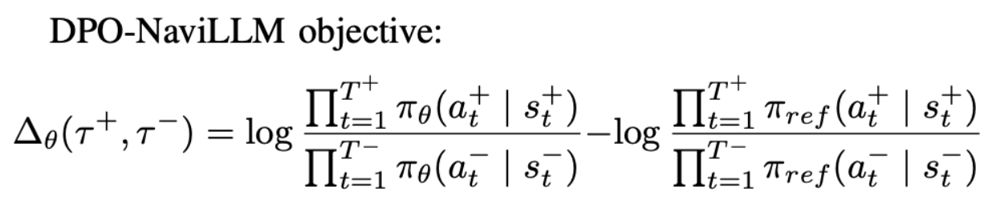
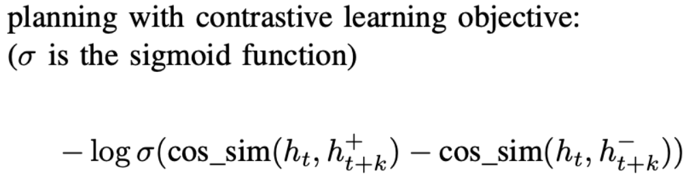
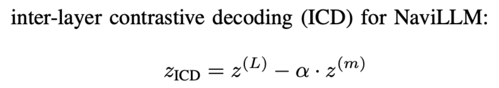

# 📊 DPO-NaviLLM

Core Task: Vision-and-Language Navigation

Research Problem: Generalization

## Identify the SOTA method

- RoomTour3D (RoomTour3D: Geometry-Aware Video-Instruction Tuning for Embodied Navigation) is the current SOTA from CVPR 2025
- an effective baseline, worth reading too: NaviLLM from CVPR 2024 (Towards Learning a Generalist Model for Embodied Navigation)
- RoomTour3D [code](https://github.com/roomtour3d/roomtour3d-NaviLLM)
- NaviLLM [code](https://github.com/zd11024/NaviLLM)

## Replicate the code

activate the environment:

```bash
conda activate navillm
```

export a bunch of nonsense paths:

```bash
export PYTHONPATH=$HOME/DPO-NaviLLM/Matterport3DSimulator/build:$PYTHONPATH
export CUDA_VISIBLE_DEVICES=0
export __EGL_VENDOR_LIBRARY_FILENAMES=/usr/share/glvnd/egl_vendor.d/10_nvidia.json
export __GLX_VENDOR_LIBRARY_NAME=nvidia
export EGL_PLATFORM=surfaceless
export LD_LIBRARY_PATH=$CONDA_PREFIX/lib:$HOME/local_epoxy/lib/x86_64-linux-gnu:/usr/lib/x86_64-linux-gnu/nvidia/current:/usr/lib/x86_64-linux-gnu:$LD_LIBRARY_PATH
export JAVA_HOME=$jdk_path
export PATH=$JAVA_HOME/bin:$PATH
export CLASSPATH=.:$JAVA_HOME/lib/dt.jar:$JAVA_HOME/lib/tools.jar
```

test to make sure **MatterSim** works:

```bash
python toy.py # OK: init w/ rendering disabled
```

### replicate CVDN, SOON, R2R, REVERIE eval results

- Validation-Unseen: simple run locally
- Test: save prediction results and upload to the leaderboard

| datasets | CVDN:Val-U | CVDN:Test | SOON:Val-U | SOON:Test | R2R:Val-U | R2R:Test | REVERIE:Val-U | REVERIE:Test |
| -------- | ---------- | --------- | ---------- | --------- | --------- | -------- | ------------- | ------------ |
| [NaviLLM](https://arxiv.org/pdf/2312.02010) | 6.16 | 7.90 | 29.24 | 26.26 | 59 | 60 | 35.68 | 32.33 |
| NaviLLM* | **6.13** | **[7.85](https://eval.ai/web/challenges/challenge-page/463/leaderboard/1292)** | **28.88** | **[26.5](https://eval.ai/web/challenges/challenge-page/1275/overview)** | **58.58** | **[60](https://eval.ai/web/challenges/challenge-page/97/leaderboard)** | **35.45** | **[32.24](https://eval.ai/web/challenges/challenge-page/606/leaderboard/1683)** | 
| [RoomTour3D](https://arxiv.org/pdf/2412.08591) | 6.33 | 7.22 | 31.7 | 27.8 | 62.4 | 62.2 | 37.4 | 36.4 |
| RoomTour3D* | **6.24** | [6.92](https://eval.ai/web/challenges/challenge-page/463/my-submission) | **29.87** | [26.41](https://eval.ai/web/challenges/challenge-page/1275/my-submission) | **61.17** | [61](https://eval.ai/web/challenges/challenge-page/97/leaderboard/270) | **37.94** | [34.77](https://eval.ai/web/challenges/challenge-page/606/my-submission) |


```bash
bash scripts/evaluation/eval_cvdn.sh
bash scripts/evaluation/eval_r2r.sh
bash scripts/evaluation/eval_soon.sh
bash scripts/evaluation/eval_reverie.sh
```

## Propose some new ideas regarding to generalization

1. DPO-NaviLLM
- reference model:
  - Reference = frozen copy of current RoomTour3D/NaviLLM checkpoint
  - Policy = trainable copy initialized from the same weights
- preference pairs:
  - sample two different rollouts per instruction (with gradient disabled)
  - pick the rollout with higher SPL (Success weighted by Path Length)
- DPO-NaviLLM objective: 
  - 


2. planning with contrastive learning on NaviLLM
- training pairs:
  - sample two different rollouts per instruction
  - high SPL -> positive, low SPL -> negative
- current state h(t): 
  - use the navigation **CLS token embedding** at step t (t < max_action_len)
  - sample a few t (2~4) per trajectory
- future state h(t+k):
  - sample k from a set of values (like {2, 3, 5})
- planning with contrastive learning objective: 
  - 

3. inter-layer contrastive decoding for NaviLLM
- navigation logits after passing full (L) layers
- navigation logits after passing intermediate (m) layers (early exit)
- 


## Implement a specific idea


